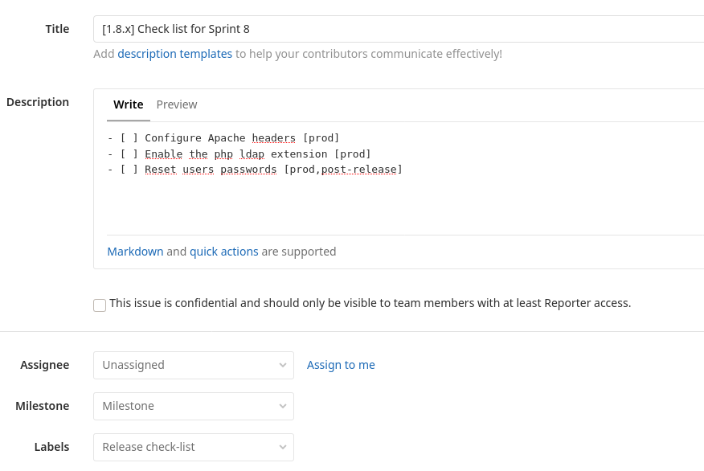
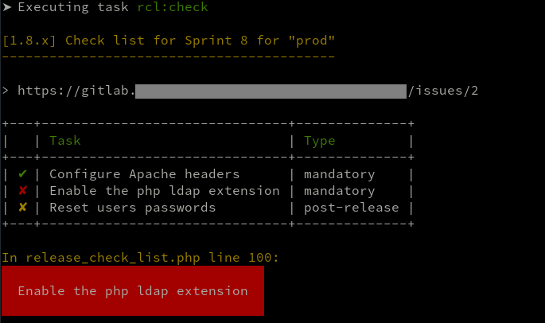
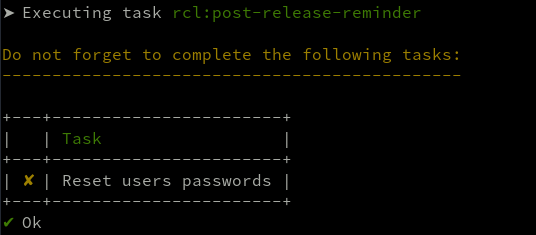

# Release check-list for Deployer

A simple recipe for [Deployer](https://github.com/deployphp/deployer) to manage a release check-list using Gitlab issues.

The idea is the handle a list of mandatory (and non-blocking) tasks for a release.  
This is made possible using a Gitlab issue (with its tasks system), with specific title and label (customisable). 
 
## Installation

```bash
composer require novaway/deployer-release-check-list
```

## Configuration

```php
// deploy.php
<?php

//...

require 'recipe/release_check_list.php';

set('rcl_gitlab_host', 'https://gitlab.example.com');
set('rcl_gitlab_api_key', 'MY_API_TOKEN');
set('rcl_gitlab_project_id', 'MY_PROJECT_ID');
```

## Usage

First, create a Gitlab issue with:
 * a label named "**Release check-list**" (can be customized, see options below)
 * a title following the format "**[MAJOR.MINOR.x]** My awesome check-list".
   
For example: "**[1.8.x]** My awesome check-list".

This issue will match all deployments based on a **git tag** beginning with `1.8`:
```bash
bin/dep deploy prod --tag=1.8.6
```

Within the issue, you need a create a (one-level) [task list](https://docs.gitlab.com/ee/user/markdown.html#task-lists):



Each task accepts two types of optional flags:
* one for the targeted **Deployer host**: `prod`, `staging`, ...
* one for tasks that need to be done **after the deployment**: `post-release` (non-flagged tasks will be mandatory for the deployment and throw an error if not marked as done)

Example:
```text
- [ ] Task 1 [prod,staging]
- [ ] Task 2 [prod,post-release]
- [ ] Task 3
```
* `Task 1` will be **mandatory** before the deployment on `prod` and `staging` hosts
* `Task 2` will be **non-blocking** for the deployment on `prod` host, but will be reminded once the deployment is successful
* `Task 3` will be **mandatory** before the deployment on **all hosts**


### Options

#### Customizing the Gitlab label
```php
set('rcl_gitlab_label', 'Foo list');
```

#### Customizing how to get the release version
By default, `rcl_release_version` is based on `input()->getOption('tag')`.
```php
set('rcl_release_version', get('my_release_version'));
```

### Examples

In case of an uncompleted mandatory task:  


Reminder for `post-release` tasks:  


### Bonus

Get a slack notification for uncompleted post-release tasks (considering you already configured the slack recipe):
```php
// deploy.php
use Deployer\Task\Context;
use Deployer\Utility\Httpie;

task('rcl:post-release-slack-reminder', function() {
    if (!get('slack_webhook', false)) {
        return;
    }

    $pendingPostReleaseTasks = get('rcl_pending_post_release_tasks', []);
    if (count($pendingPostReleaseTasks) === 0) {
        return;
    }

    $text = implode(PHP_EOL, array_map(function($item) {
       return '- '.$item[1];
    }, $pendingPostReleaseTasks));

    $host = Context::get()->getHost()->getHostname();

    $attachment = [
        'title' => sprintf('[%s][%s] Pending post-release tasks:', $host, get('release_version')),
        'text' => $text,
        'color' => get('slack_color'),
        'mrkdwn_in' => ['text'],
    ];

    Httpie::post(get('slack_webhook'))->body(['attachments' => [$attachment]])->send();
});

after('success', 'rcl:post-release-slack-reminder');
```